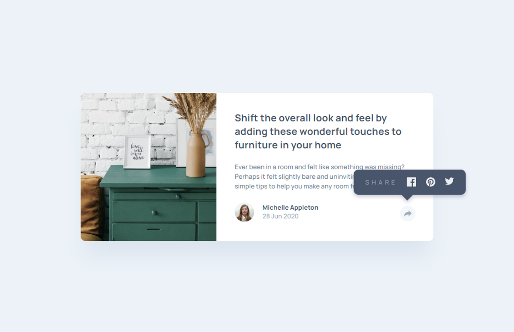

# Frontend Mentor - Article preview component

## The challenge

Your challenge is to build out this article preview component and get it looking as close to the design as possible.

You can use any tools you like to help you complete the challenge. So if you've got something you'd like to practice, feel free to give it a go.

The only JavaScript you'll need for this challenge is to initiate the share options when someone clicks the share icon.

Your users should be able to: 

- View the optimal layout for the component depending on their device's screen size
- See the social media share links when they click the share icon

## Table of contents

- [Overview](#overview)
  - [The challenge](#the-challenge)
  - [Screenshot](#screenshot)
  - [Links](#links)
- [My process](#my-process)
  - [Built with](#built-with)
  - [What I learned](#what-i-learned)
  - [Useful resources](#useful-resources)
- [Author](#author)

### Screenshot

### Links

- Solution URL: [Frontend Mentor Solution](https://www.frontendmentor.io/solutions/article-preview-component-pure-css-no-js-custom-hover-states-ax1tv44e_s)
- Live Site URL: [Live Site at Vercel](https://article-preview-component-8qe4o2q46-correlucas.vercel.app/)
## My process

### Built with

- Semantic HTML5 markup
- BEM
- Grid
- Responsive Design

### What I learned

This challenge help me to understand how to use better the "transform: translateX / translateY" and apply it to position one element over other. I learned how to use one input to display another div, in this challenge this was useful, because I used on input to display a social media icon popup while the input was checked, with the selector "~" example --> #input:checked ~ #social-media-icon {display: flex},this was my solution only with CSS.

### Useful resources

- [BEM 101](https://sparkbox.com/foundry/bem_by_example) - BEM 101

## Author
- Github - [correlucas](https://github.com/correlucas/order-summary-component)
- Frontend Mentor - [@correlucas](https://www.frontendmentor.io/profile/correlucas)
